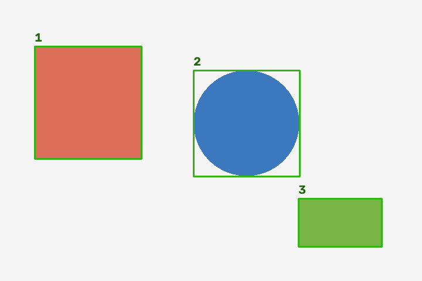
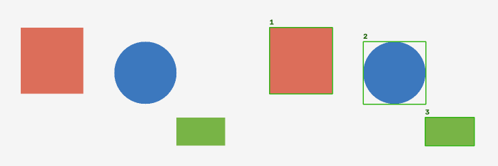
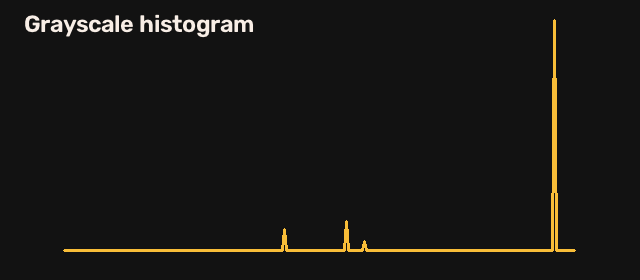

# Vision Workbench

> 本地图片边缘与区域分析工具








## What runs today

OpenCV Canny、轮廓提取、区域框选、亮度统计和灰度直方图；导出输入、边缘图、标注图、对照图及 JSON。默认生成三个几何形状作为可复现样例。不是 YOLO 语义检测器，尚无追踪与 ONNX 功能。

## Quick start

```bash
git clone https://github.com/foxviot/vision-workbench.git
cd vision-workbench
python -m pip install -r requirements.txt
python analyze.py
```

## Custom input

```text
python analyze.py --input your-image.jpg --output output
```

## Results and limits

样例输出来自实际运行。速度随硬件与依赖版本变化；示例结果不代表生产环境性能。默认运行不需要 API Key、GPU 或云服务。

## Attribution

详见 [ATTRIBUTION.md](ATTRIBUTION.md)。复用 OpenCV/NumPy 的公开 API，应用编排代码为本仓库新增。

本仓库新增代码采用 [MIT](LICENSE)，依赖库和数据保持各自许可证。本项目不代表上游官方项目。
