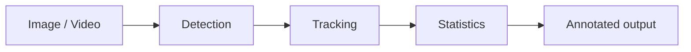

# Vision Workbench

 

**From pixels to inspectable results.**

面向视频检测、目标追踪与模型部署的视觉实验工作台设计。当前仓库包含项目蓝图，尚未实现可运行程序。

## Planned workflow

## Design scope

| Module | Planned deliverable |
|---|---|
| Inference | Image and video detection with annotated output |
| Tracking | Object IDs, trajectories and region counts |
| Evaluation | Dataset-specific accuracy and latency report |
| Deployment | ONNX export and runtime comparison |

## Technology references

[OpenCV](https://github.com/opencv/opencv) · [Ultralytics](https://github.com/ultralytics/ultralytics) · [Supervision](https://github.com/roboflow/supervision)

## Milestones

- [ ] Video inference demo
- [ ] Named dataset and evaluation command
- [ ] ONNX export example
- [ ] Measured FPS, latency and hardware details

No benchmark results or trained weights are published yet. Upstream code, datasets and model weights retain their respective licenses.
